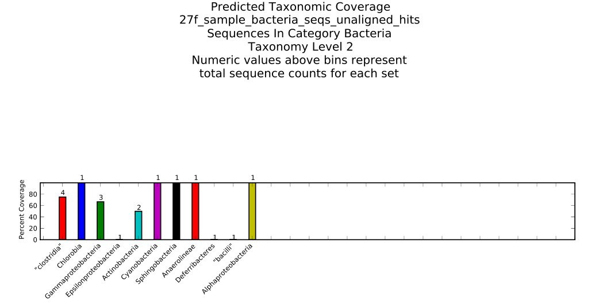

.. _tutorial:

===================================
Primer Prospector Overview Tutorial
===================================

Introduction
------------

This tutorial explains how to use the Primer Prospector pipeline to generate `de novo` primers and analyze these `de novo` primers as well as known primers to predict taxonomic coverage.

Sample files have been provided, in the ``pprospector/doc/tutorial_files/`` directory.  This directory contains two folders, one containing sample files, ``de_novo_files/``, for the `de novo` pipeline, while the second folder, ``analysis_files/``, contains sample files for using the analysis pipeline of Primer Prospector.

Sequences used for this tutorial were supplied by `Greengenes <http://greengenes.lbl.gov/>`_.  The taxonomic assignment file, as well as a complete reference 97% OTU Greengenes sequence set, is available as a `zip <http://greengenes.lbl.gov/Download/OTUs/gg_otus_6oct2010.zip>`_ file.

This tutorial covers details about the format of input files and major output of Primer Prospector.  For more details about the format of files generated and used by Primer Prospector, please see the `documentation <../documentation/file_formats.html>`_.

^^^^^^^^^^^^^^^^^^^^^^^^^
`De Novo` Primer Pipeline
^^^^^^^^^^^^^^^^^^^^^^^^^

++++++++++++++++++++++++++++
Generating `De Novo` Primers
++++++++++++++++++++++++++++

The most basic generation of `de novo` primers requires an aligned set of fasta sequences.  A small sample set of 18 aligned bacterial sequences can be downloaded `here <../../../tutorial_files/de_novo_files/sample_bacteria_seqs_aligned.fasta>`_ (right click and select save as or download).

To generate `de novo` primers from these aligned sequences, the script `generate_primers_denovo.py <../scripts/generate_primers_denovo.html>`_ is used.  This module finds conserved short sequences in the input aligned fasta file to use as the 3' region of a primer.  By default, conserved sets of five base pairs are found and recorded, along with the up and downstream sequences from these conserved sites.  To run this module with the default settings, change to the directory that the sample sequences are currently in, and use the following command:

::

	generate_primers_denovo.py -i sample_bacteria_seqs_aligned.fasta -o default_settings_primers.txt

The output file, ``default_settings_primers.txt``, should contain lines like this:

::

	# Matches that are found in at least 60.00% target sequences
	# record type,sequence,unaligned index,aligned index,number of perfect matches,percent perfect matches,percent non-specific matches
	C,GTAAA,402,2039,18,100.0%,0.0%
	M,2039,GACGGCCTTCGGGTTGTAAA,GTAAACCTCTTTCAGCAGGG,11544
	M,2039,GACGCATTTCGGTGTGTAAA,GTAAACTCCTTTTATATGTC,57484
	M,2039,GAAGGCCCTCGGGTTGTAAA,GTAAAGCACTTTCAGTAGGG,103547
	M,2039,GAAGTATTTCGGTATGTAAA,GTAAAGCTCTATCAGCAGGG,120123
	<snip>

This shows the site that is conserved, GTAAA, the location it was original found (402, 2039), and the number and percent of sequences it was found with a perfect match (18, 100%).  The upstream and downstream sequences are not necessarily conserved, as can be seen here.  The ``default_settings_primers.txt`` returns a large number of conserved sites, due to the lenient default settings.  One can increase the sensitivity requirements for these prospective `de novo` primers by setting the threshold higher with the -p parameter.  Additionally, the location that the primer is original found at may not be very informative about the true location of the primer, so a reference sequence can be supplied to give a more reasonable index to `de novo` primers.  For example, one may wish to name new small-subunit ribosomal primers based on an `E. coli` sequence that most such primers are based upon.  An example `E. coli` sequence, obtained from Greengenes, can be downloaded `here <../../../tutorial_files/de_novo_files/ecoli_sequence.fasta>`_ (right click and select save as or download).

To increase the sensitivity threshold for conserved sites and give the primers a standard index based on the `E. coli` sequence, use the following command:

::

	generate_primers_denovo.py -i sample_bacteria_seqs_aligned.fasta -p 0.95 -a ecoli_sequence.fasta -o std_index_95_perc_sensitivity.txt

The output file, ``std_index_95_perc_sensitivity.txt``, will be much smaller due to the more stringent 95% sensitivity threshold, and will contain additional indices based upon the index found in the `E. coli` sequence.  Some example lines are given below:

::

	# Matches that are found in at least 95.00% target sequences
	# record type,sequence,unaligned index,aligned index,number of perfect matches,percent perfect matches,percent non-specific matches,forward primer standard index,reverse primer standard index
	C,TGCCA,465,2228,18,100.0%,0.0%,502,537
	M,2228,CACCGGCCAACTACGTGCCA,TGCCAGCAGCCGCGGTAATA,11544
	M,2228,CACCGGCTAACTCCGTGCCA,TGCCAGCAGCCGCGGTAATA,57484
	M,2228,CACTGGCTAACTCTGTGCCA,TGCCAGCAGCCGCGGTAATA,103547
	<snip>

The additional forward and reverse standard indices are based upon the index of the prospective primer that was found in the `E. coli` sequence, corrected for the length of the sequences recorded (in this case 20 base pairs).  All primer indices in Primer Prospector are named for the 5' base pair of the primer when possible.  This standard is unfortunately not consistent across primers from literature, so be aware of this when mixing and matching primers from different sources.

Other features of `generate_primers_denovo.py <../scripts/generate_primers_denovo.html>`_ include finding conserved sites that are specific to a group of sequences and limiting the generation of primers to a specific segment of the aligned target fasta sequences.  To find sequences that are specific, one must supply a fasta file of sequences to be excluded (i.e., these sequences do not have the same conserved sites as the target sequences).  For example, one may wish to find primers that target bacterial, but not archaeal sequences.  A sample aligned fasta file with two archaeal sequences can be downloaded `here <../../../tutorial_files/de_novo_files/sample_archaeal_seqs_aligned.fasta>`_ (right click and select save as or download), which is passed to `generate_primers_denovo.py <../scripts/generate_primers_denovo.html>`_ with the -e parameter.  To select a limited range of the alignment to search, the -r parameter is used with X:Y, where X is the start index to search, and Y is the end index.  A sample command which utilizes all of the parameters discussed so far is below:

::

	generate_primers_denovo.py -i sample_bacteria_seqs_aligned.fasta -p 0.95 -a ecoli_sequence.fasta -o final_denovo_primers.txt -e sample_archaeal_seqs_aligned.fasta -r 1000:3000

The ``final_denovo_primers.txt`` file generated with these parameters is quite a bit smaller and more refined than the initial primers, and will be used for the subsequent step of the `de novo` pipeline.

+++++++++++++++++++++++++++++++++++++++
Sorting and Filtering `De Novo` Primers
+++++++++++++++++++++++++++++++++++++++

`sort_denovo_primers.py <../scripts/sort_denovo_primers.html>`_ is used to combine, sort, and compare the complete primer sequences generated with `generate_primers_denovo.py <../scripts/generate_primers_denovo.html>`_.  The ``final_denovo_primers.txt`` file generated during the previous step can be used for this tutorial, or can be downloaded `here <../../../tutorial_files/de_novo_files/final_denovo_primers.txt>`_ (right click and select save as or download).

The following is a basic command for `sort_denovo_primers.py <../scripts/sort_denovo_primers.html>`_ that uses the default settings:

::

	sort_denovo_primers.py -i final_denovo_primers.txt

Two files will be output by running this script: ``formatted_primers.txt`` and ``primers_details.txt``.  For more information about the format and data in ``primers_details.txt`` see the `documentation <../documentation/file_formats.html>`_.  The `de novo` primers are saved in a format usable for downstream analysis in the ``formatted_primers.txt`` file.  A snippet of this file is shown below:

::

	# primer_id <tab> primer sequence (5'->3')
	347f	GGGAGGCAGCAGTGRGGAAT
	387f	CTGAYSCAGCRAYGCCGCGT
	<snip>
	366r	TTCCYCACTGCTGCCTCCCG
	542r	CTMCGTATTACCGCGGCTGC
	360r	ACTGCTGCCTCCCGTAGGAG
	<snip>

Note that the forward primers are listed first, followed by the reverse primers.  By default, these primers are sorted according to descending sensitivity (since these `de novo` primers all had 100% matches with the target sequences, the order is random).  Both the forward and reverse primers are listed in 5' to 3' direction, and all modules in Primer Prospector that take input primers use this format.

Comparison to known primers is possible at this step, to avoid the accidental reuse of primers that already exist.  A properly formatted primers file containing a handful of known primers (27f, 338r, 515f, 806r) can be downloaded `here <../../../tutorial_files/de_novo_files/known_primers.txt>`_ (right click and select save as or download).

An additional feature of `sort_denovo_primers.py <../scripts/sort_denovo_primers.html>`_ is finding forward and reverse primer pairs that yield amplicons of a predicted size range (certain sequencing technologies, despite current claims, do not handle large amplicons well so smaller amplicons may be preferable).  To get accurate predictions, a standard alignment file needs to be supplied to `generate_primers_denovo.py <../scripts/generate_primers_denovo.html>`_.  See the -a option in the tutorial section for `generating de novo primers <tutorial.html#generating-de-novo-primers>`_.

The following command compares the *de novo* primer file ``final_denovo_primers.txt`` to the known primers file ``known_primers.txt`` and also generates a file containing amplicons predicted to be between 200 and 400 base pairs:

::

	sort_denovo_primers.py -i final_denovo_primers.txt -a 200:400 -k known_primers.txt

This will generate the same ``formatted_primers.txt`` and ``primers_details.txt`` that running with the default settings created.  Two additional files, ``amplicon_len_pairs.txt`` and ``primers_overlap.txt``, should also be present.  The truncated output of the ``primers_overlap.txt`` file follows:

::

	#Unique primers that do not overlap or share 3' ends with known primers
	#primer name<tab>primer sequence
	387f	CTGAYSCAGCRAYGCCGCGT
	325f	GAGACACGGCCCAGACTCCT
	326f	AGACACGGCCCAGACTCCTA
	<snip>
	#Primers overlapping with known primers.
	#primer name<tab>primer sequence<tab>known primer name<tab>known primer sequence<tab>overlapping sequence
	347f	GGGAGGCAGCAGTGRGGAAT	338r	GCTGCCTCCCGTAGGAGT	GCTGCCTCCC
	331f	CGGCCCAGACTCCTACGGGA	338r	GCTGCCTCCCGTAGGAGT	TCCCGTAGGA
	507f	GCTAACTMCGTGCCAGCAGC	515f	GTGCCAGCMGCCGCGGTAA	GTGCCAGCAG
	340f	CTCCTACGGGAGGCAGCAGT	338r	GCTGCCTCCCGTAGGAGT	GCTGCCTCCC
	332f	GGCCCAGACTCCTACGGGAG	338r	GCTGCCTCCCGTAGGAGT	CTCCCGTAGG
	509f	TAACTMCGTGCCAGCAGCCG	515f	GTGCCAGCMGCCGCGGTAA	GTGCCAGCAG
	<snip>
	#Primers sharing 3' ends with known primers.
	#primer name<tab>primer sequence<tab>known primer name<tab>known primer sequence
	359r	CTGCTGCCTCCCGTAGGAGT	338r	GCTGCCTCCCGTAGGAGT

The ``primers_overlap.txt`` has three components; the first section contains primers that have no overlap with the supplied known primers, the second section contains primers with partial overlap, and the final section contains primers that overlap and have matching 3' ends.  In this case, our `de novo` primers found an exact match to the 338r primer.  The disparity in the indices (359 for the `de novo` primer versus 338) is due to 338r being named for the 3' position of the primer, rather than the 5' position.  Primer Prospector uses the 5' position of the primer, whether it is forward or reverse to name primers, but this is not necessarily consistent with primers from other sources, so be wary.  The default sequence length for "hitting" a partial overlap is 10 base pairs, which can be modulated with the -m parameter when using `sort_denovo_primers.py <../scripts/sort_denovo_primers.html>`_.

Below is a partial listed of the ``amplicon_len_pairs.txt`` file.  This file shows the primer pairs that match the criteria for the amplicon length (In this case, between 200 and 400 base pairs).  Note that we define amplicons as the distance between the 3' position of the primers, and does not include primer length in amplicon size calculations.

::

	# Primer pairs within estimated amplicon size
	# Min size: 200
	# Max size: 400
	
	325f	GAGACACGGCCCAGACTCCT
	568r	CARTAAWTCCGRAYAACGCT
	Estimated amplicon size: 203
	
	325f	GAGACACGGCCCAGACTCCT
	569r	CCARTAAWTCCGRAYAACGC
	Estimated amplicon size: 204
	<snip>

^^^^^^^^^^^^^^^^^^^^^^^^
Primer Analysis Pipeline
^^^^^^^^^^^^^^^^^^^^^^^^

++++++++++++++
Primer Scoring
++++++++++++++

The core module for the primer analysis pipeline is `analyze_primers.py <../scripts/analyze_primers.html>`_.  This module takes input primer(s) and fasta file(s), and scores the primer(s) for each sequence in the fasta file(s).  Summary graphs for the primer's predicted performance are generated, along with "hits" files recording the primer's score and other details for each sequence.

To run `analyze_primers.py <../scripts/analyze_primers.html>`_, one needs unaligned fasta file(s).  Unaligned versions of the bacterial and archaeal sequences used in the `de novo` tutorial are available `here <../../../tutorial_files/analysis_files/sample_archaeal_seqs_unaligned.fasta>`_ and `here <../../../tutorial_files/analysis_files/sample_bacteria_seqs_unaligned.fasta>`_ (right click and select save as or download).

Additionally, one needs to supply a file containing primers in the proper format or manually specify a primer to use.  The primers file format consists of the primer name, followed by "f" or "r" (e.g., 27f), followed by a tab, followed by the primer sequence (5' to 3').  An example primers file in the proper format can be downloaded `here <../../../tutorial_files/analysis_files/primers.txt>`_ (right click and select save as or download).  ``primers.txt`` contains three primers, two of which are from literature (27f, 388r), and one is a primer generated by Primer Prospector during the `de novo` tutorial (325f).  To test these primers against the bacterial sequences, use the following command:

::

	analyze_primers.py -f sample_bacteria_seqs_unaligned.fasta -P primers.txt

For each of the primers, a summary graph and a "hits.txt" file is generated.  The output graph for the `de novo` primer 325f is shown below:

This graph shows basic details about the primer and sequences tested, and also the scoring parameters for the final weighted score, listed at the bottom of the graph.  Weighted scores give higher penalties to primers that poorly match the sequence in the 3' region of the primer.  One can modulate these scoring parameters, including the length of the 3' region of a primer.  To set the 3' length to 8 base pairs, the penalty for 3' mismatches to 1.2, and the penalty for non 3' mismatches to 0.5, use the following command:

::

	analyze_primers.py -f sample_bacteria_seqs_unaligned.fasta -P primers.txt -e 8 -t 1.2 -T 0.5

For each primer and fasta file tested, a "hits" file containing the scoring data for each sequence will be generated.  An partial hits file for the 325f primer is given below (using the altered scoring parameters given above):

::

	# Primer: 325f 5'-GAGACACGGCCCAGACTCCT-3'
	# Input fasta file: sample_bacteria_seqs_unaligned.fasta
	# Parameters
	# 3' length: 8
	# non 3' mismatch penalty: 0.50 per mismatch
	# 3' mismatch penalty: 1.20 per mismatch
	# last base mismatch penalty: 3.00
	# non 3' gap penalty: 1.00 per gap
	# 3' gap penalty: 3.00 per gap
	# Note - seq hit and primer hit are the best local pairwise alignment results for a given sequence and primer pair.  A gap in seq hit represents a deletion in the sequence, whereas a gap in the primer hit signifies an insertion in the target sequence.
	#
	# seq ID, seq hit, primer hit, hit start position, non 3' mismatches, 3' mismatches (except last base), last base mismatch, non 3' gaps, 3' gaps, overall weighted score, hits sequence end 
	11544,GAGACACGGCCCAGACTCCT,GAGACACGGCCCAGACTCCT,293,0,0,False,0,0,0.0,False
	57484,GAGACACGGACCAGACTCCT,GAGACACGGCCCAGACTCCT,288,1,0,False,0,0,0.5,False
	103547,GAGACACGGCCCAGACTCCT,GAGACACGGCCCAGACTCCT,316,0,0,False,0,0,0.0,False
	<snip>

These hits files are used in many of the subsequent primer analyses steps.  For more details about the format of this file, see the `documentation <../documentation/file_formats.html>`_.

Multiple target fasta sequences can be tested with `analyze_primers.py <../scripts/analyze_primers.html>`_ by separating the input fasta files with a colon.  To test both the bacterial and archaeal sequences used during the `de novo` pipeline with default scoring parameters, use the following command:

::

	analyze_primers.py -f sample_bacteria_seqs_unaligned.fasta:sample_archaeal_seqs_unaligned.fasta -P primers.txt

In addition to the original bacterial graphs and hits files, archaeal graphs and hits files will be generated for each primer.  The archaeal graph for the 325f primer follows.

As this primer was designed to not match these two archaeal sequences, at least at the 3' end, the poor scoring of the primers against these archaeal sequences is expected.

One can manually enter a primer sequence instead of supplying an input text file.  To manually enter a primer sequence, the primer name (-p) and sequence (-s) needs to be entered.  An example command, using the 338r primer, is shown below (Note that primer names must end with "f" or "r", and the sequence must be written 5' to 3'):

::

	analyze_primers.py -f sample_bacteria_seqs_unaligned.fasta -p 338r -s GCTGCCTCCCGTAGGAGT

++++++++++++++++++++++++++++++
Generating Amplicons and Reads
++++++++++++++++++++++++++++++

Amplicons (defined here as the sequence region between the 3' ends of a primer pair) or reads (generally partial fragments of the amplicons that are sequenced with 454 or Illumina technology from one end of the amplicon) for primer pairs can be generated with the script `get_amplicons_and_reads.py <../scripts/get_amplicons_and_reads.html>`_.  Amplicons generated from this module can be used for visualizing predicted amplicon sizes and reads can be used to predict the taxonomic usefulness of a particular amplicon, and which primer to sequence from for optimal results.

Generation of amplicons and reads is based upon the primer data and scores contained in the hits files created by `analyze_primers.py <../scripts/analyze_primers.html>`_.  These hits files contain the location of the primer for each sequence, and scoring for said primer (i.e., the expectation that the primer will successfully amplify the given sequence).  Primers that perform poorly are expected to not produce amplicons, and will not be included in the output amplicons and reads to avoid possible aberrant results.

To generate sample amplicons and reads, one needs hits files and unaligned fasta sequences.  A sample bacterial fasta file is available `here <../../../tutorial_files/analysis_files/sample_bacteria_seqs_unaligned.fasta>`_ (right click and select save as or download), as well as a 27f primer `hits file <../../../tutorial_files/analysis_files/27f_sample_bacteria_seqs_unaligned_hits.txt>`_ and 338r primer `hits file <../../../tutorial_files/analysis_files/338r_sample_bacteria_seqs_unaligned_hits.txt>`_.

To generate amplicons and reads from the 27f and 388r primer pair, use the following command:

::

	get_amplicons_and_reads.py -f sample_bacteria_seqs_unaligned.fasta -i 27f_sample_bacteria_seqs_unaligned_hits.txt:338r_sample_bacteria_seqs_unaligned_hits.txt

This generates two files, ``27f_338r_amplicons.fasta`` and ``27f_338r_r_250_reads.fasta``.  With the default settings for primer scoring, only 12 of the original 18 sequences are included as amplicons and reads.  Additionally, only the reverse reads are generated.

One can change the score threshold (-t), score type (-s), read size (-R), and type of read generated (-d).  One could, for example, change the scoring type to overall mismatches instead using the weighted score, set the threshold for inclusion to 6 (i.e., 6 mismatches), generate 100 base pair reads, and get reads from both the forward and reverse primers with the following command:

::

	get_amplicons_and_reads.py -f sample_bacteria_seqs_unaligned.fasta -i 27f_sample_bacteria_seqs_unaligned_hits.txt:338r_sample_bacteria_seqs_unaligned_hits.txt -t 6 -s overall_mismatches -R 100 -d p

This will generate three files:  ``27f_338r_amplicons.fasta``, ``27f_338r_f_100_reads.fasta`` (forward reads), and ``27f_338r_r_100_reads.fasta`` (reverse reads).  Because of the less restrictive settings, 13 of the original 18 sequences will be included in the amplicons and reads.  The remaining 5 sequences are not written as the results are not logical (the forward primer is so poorly matched with the sequence that its best hit is downstream from the reverse primer).

+++++++++++++++++++
Amplicon Histograms
+++++++++++++++++++

Visual displays of predicted amplicon sizes can be useful in determining the viability of a given primer pair, given that sequencing technology has limits on the size of amplicons that can be reads.  The `amplicons_histograms.py <../scripts/amplicons_histograms.html>`_ module will generate graphs showing amplicon sizes for rapid assessment of the size and dispersion of predicted amplicons.  Note-this does not include the size of any primers, barcodes, or adapters used.

A sample `amplicons file <../../../tutorial_files/analysis_files/27f_338r_amplicons.fasta>`_ (right click and select save as or download) can be used for this tutorial.

To generate the histogram, use the following command:

::

	amplicons_histograms.py -f 27f_338r_amplicons.fasta

A graph, like the one displayed below, will show the sizes of the predicted amplicons.

Separation of amplicons according to the domain of life may be useful, especially if eukaryotic organisms are included.  `amplicons_histograms.py <../scripts/amplicons_histograms.html>`_ will split the amplicons according to the domain of life if a taxonomy mapping file is included.  A sample taxonomy mapping file can be downloaded `here <../../../tutorial_files/analysis_files/taxonomy_mapping.txt>`_ (right click and select save as or download).  To utilize this taxonomy mapping file, use the following command:

::

	amplicons_histograms.py -f 27f_338r_amplicons.fasta -t taxonomy_mapping.txt

+++++++++++++++++++++++++++++++++++++++
Assessing Taxonomic Usefulness of Reads
+++++++++++++++++++++++++++++++++++++++

DNA sequences that are highly conserved are not particularly useful in terms of taxonomic assignment of phylogenetic analysis.  `taxa_assignment_report.py <../scripts/taxa_assignment_report.html>`_ will assign taxonomy to a group of reads, and by comparing to known taxonomies, will generate a report about the accuracy and depth of these assignments.  For more information about generating reads from prospective primers, see `Generating Amplicons and Reads <tutorial.html#generating-amplicons-and-reads>`_.

Currently, only the RDP classifier is implemented for taxonomic assignment.

`taxa_assignment_report.py <../scripts/taxa_assignment_report.html>`_ requires a `taxonomy mapping file <../../../tutorial_files/analysis_files/taxonomy_mapping.txt>`_ and a sequence `reads file <../../../tutorial_files/analysis_files/27f_338r_r_250_reads.fasta>`_ (right click and select save as or download) in fasta format.  Taxonomic assignment can be slow, particularly for a large number of sequences.

To run this module with the sample files, use the following command:

::

	taxa_assignment_report.py -t taxonomy_mapping.txt -f 27f_338r_r_250_reads.fasta

Two files will be generated by this module, ``27f_338r_r_250_reads_accuracy_report.txt`` and ``27f_338r_r_250_reads_assignments.txt``.

Read assignments will be in a format like the following, where the sequence ID in the reads file is followed by the taxonomic assignment and confidence score:

::

	254376	Root;Bacteria;Firmicutes;"Clostridia";Clostridiales;"Lachnospiraceae";Roseburia	0.990
	256904	Root;Bacteria	0.990
	339039	Root;Bacteria;Proteobacteria	0.850
	300253	Root;Bacteria;Firmicutes;"Clostridia";Clostridiales;"Ruminococcaceae"	0.980
	300250	Root;Bacteria;Firmicutes;"Clostridia";Clostridiales	0.960
	<snip>

The ``27f_338r_r_250_reads_accuracy_report.txt`` file shows the accuracy of the assignments and the accuracy in descending levels of taxonomic depths (i.e., the more specific categorization at the phylum, class, family, etc. level).

::

	# Taxonomy Assignment Report File
	# This report starts at the highest level of taxa (i.e., Domain level)
	# and lists the accuracy of the assignment and the number of sequences
	# that had a taxonomic assignment and taxonomic mapping to that depth
	# Fasta file used for taxonomic assignments: 27f_338r_r_250_reads.fasta
	# Assignment method: rdp
	# Start report accuracy data
	# Taxa level, percent accurate assignment, number of sequences with taxa defined at this level
	0,100.000,12
	1,100.000,9
	2,62.500,8
	Sequences lacking corresponding ID in taxonomy mapping file: 0
	Sequences assigned only as 'Root': 0

Note the both the accuracy of assignment and the number of sequences defined at levels 1 (phylum) and 2 (class) are lower than level 0 (domain).  Defined taxa at a given level depends both upon the assignment and the input taxonomy mapping file.  The taxonomic depth reported can be increased by using the -d parameter.

++++++++++++++++++
Optimizing Primers
++++++++++++++++++

Primers can be optimized to increase sensitivity or to lower unneeded degeneracy with the `optimize_primers.py <../scripts/optimize_primers.html>`_ module.

This module uses the target sequence hits from primer hits files generated by `analyze_primers.py <../scripts/analyze_primers.html>`_ to create a tab delineated output file containing base frequencies for each position in the primer.  In this example, a 27f primer `hits file <../../../tutorial_files/analysis_files/27f_sample_bacteria_seqs_unaligned_hits.txt>`_ (right click and select save as or download) is used to demonstrate the output of `optimize_primers`.

To run this module with the default settings, use the following command:

::

	optimize_primers.py -i 27f_sample_bacteria_seqs_unaligned_hits.txt

This generates a file, named *27f_sample_bacteria_seqs_unaligned_hits_base_frequencies.txt*, which contains the following:

::

	# Base frequency report for optimizing primers
	# This file is tab separated for easy importation into Excel or other spreadsheets
	# Degenerate DNA codes (listed here for convenience): R=AG, Y=CT, M=AC, K=GT, W=AT, S=CG, B=CGT, D=AGT, H=ACT, V=ACG, N=ACGT
	# The primer is listed in 5' to 3' orientation.
	# Hits file used to generate base frequency data: 27f_sample_bacteria_seqs_unaligned_hits.txt
	# Score type used: weighted_score
	# Score threshold: 2
	# Primer sequence: AGAGTTTGATCMTGGCTCAG
	#
	Primer	A	G	A	G	T	T	T	G	A	T	C	M	T	G	G	C	T	C	A	G
	Base
	A	1.00	0.00	0.91	0.00	0.00	0.00	0.00	0.00	0.91	0.00	0.00	0.36	0.00	0.00	0.00	0.00	0.00	0.00	1.00	0.00
	T	0.00	0.00	0.00	0.00	1.00	0.91	1.00	0.09	0.09	1.00	0.27	0.00	1.00	0.00	0.00	0.00	1.00	0.00	0.00	0.00
	C	0.00	0.00	0.00	0.00	0.00	0.09	0.00	0.00	0.00	0.00	0.73	0.64	0.00	0.00	0.00	1.00	0.00	1.00	0.00	0.00
	G	0.00	1.00	0.09	1.00	0.00	0.00	0.00	0.91	0.00	0.00	0.00	0.00	0.00	1.00	1.00	0.00	0.00	0.00	0.00	1.00

This sample output file can be downloaded `here <../../../tutorial_files/analysis_files/27f_sample_bacteria_seqs_unaligned_hits_base_frequencies.txt>`_ (right click and select save as or download).

In this example, the "C" in base position 11 of the primer could be changed to a "Y", which would increase the sensitivity of the primer as 27% of the sequences have a "T" in that position.

++++++++++++++++++
Generating Linkers
++++++++++++++++++

Linkers, generally 2 base pair sequences between the 5' end of a primer and a barcode or adapter can be generated with the `generate_linkers.py <../scripts/generate_linkers.html>`_ module.  The bases that complement the target sequences the least are given as the suggested linkers.  To generate linkers, a hits file (see `primer scoring <tutorial.html#primer-scoring>`_) and the fasta sequences used to generate this hits file is required.  A sample 338r primer `hits file <../../../tutorial_files/analysis_files/338r_sample_bacteria_seqs_unaligned_hits.txt>`_ and bacterial `fasta file  <../../../tutorial_files/analysis_files/sample_bacteria_seqs_unaligned.fasta>`_ (right click and select save as or download) can be used for this tutorial.

To generate suggested linkers with these sample files, use the following command:

::

	generate_linkers.py -i 338r_sample_bacteria_seqs_unaligned_hits.txt -f sample_bacteria_seqs_unaligned.fasta

This will generate one file named ``338r_sample_bacteria_seqs_unaligned_hits_suggested_linkers.txt``, which contains the following:

::

	# Summary data for suggested linkers
	# Note-degenerate bases are ignored for linker results, as are linkers that
	# exceed the length of the input fasta sequence.  Base position starts at the
	# 5' position of the linker, so position 0 would be the 5' most base in the
	# linker, position 1 would be the next base, and so on.
	Hits file used to generate linkers: 338r_sample_bacteria_seqs_unaligned_hits.txt
	Score type used: weighted_score
	core threshold: 1
	
	Base position 0
	A: 0.000 T: 0.000 C: 1.000 G: 0.000 
	Base position 1
	A: 0.000 T: 1.000 C: 0.000 G: 0.000 
	
	Suggested linker sequence:
	AA
	Worst linker sequence:
	CT

These suggested linkers are written in the 5'->3' direction, and should be placed at the 5' end of a given primer.  In the above example, we used the primer 338r (5'-GCTGCCTCCCGTAGGAGT-3').  The full suggested linker and primer would be (5'-AAGCTGCCTCCCGTAGGAGT-3').

+++++++++++++++++++++++++++++
Predicting Taxonomic Coverage
+++++++++++++++++++++++++++++

To easily visualize predicted taxonomic coverage of a given primer or primer pair, use the `taxa_coverage.py <../scripts/taxa_coverage.html>`_ module.  This module requires a hits file (see `primer scoring <tutorial.html#primer-scoring>`_) and taxonomy mapping file.  An example `hits <../../../tutorial_files/analysis_files/27f_sample_bacteria_seqs_unaligned_hits.txt>`_ and `taxonomy mapping <../../../tutorial_files/analysis_files/taxonomy_mapping.txt>`_ (right click and select save as or download) file can be used for this tutorial.  For more details about Primer Prospector file formats, please see the `documentation <../documentation/file_formats.html>`_.

For this example, we will use the 27f primer, a common primer used for bacterial based analyses.

To generate the taxonomic coverage summary file and graphs and, use the following command:

::

	taxa_coverage.py -i 27f_sample_bacteria_seqs_unaligned_hits.txt -T taxonomy_mapping.txt

A folder named ``27f_sample_bacteria_seqs_unaligned_hits_primer_coverage`` will be created in the current directory.  In this folder, there will be three graphs, a log file, and a ``27f_sample_bacteria_seqs_unaligned_hits_coverage.txt`` text file.  The graphs will be for taxonomy levels 0, 1, and 2 (domain, phylum, and class respectively).  Bacteria is the only category for the domain level graph as no archaea or eukarya were included in these sample files.  The expected output graph for the domain coverage is show below:

This shows that approximately 60% of the 18 sequences are expected to be amplified by the primer 27f.  Taxonomy level 1, or phylum level, is shown next:

And lastly, taxonomy level 2, the class level:

A comma separated text file containing these same data are also generated, for easy insertion into a spreadsheet program.  The contents of the file, ``27f_sample_bacteria_seqs_unaligned_hits_coverage.txt`` is shown below:

::

	# This file is written in descending levels of taxonomic depth
	# Each line beings with the taxonomy level, followed by the first level of 
	# taxonomy for a given sequence, generally the domain, followed the taxonomy 
	# for the current level.
	# The total sequences for a given taxonomy are listed first, followed by the
	# percentage that are lower to or equal to the threshold score for passing.
	# taxonomy level, first level taxonomy, taxonomy classification for current level, total seqs for given classification, percent seqs passing score
	0,Bacteria,Bacteria,18,0.6667
	1,Bacteria,Proteobacteria,5,0.6000
	1,Bacteria,Firmicutes,5,0.6000
	1,Bacteria,Bacteroidetes,1,1.0000
	1,Bacteria,Chloroflexi,1,1.0000
	1,Bacteria,Deferribacteres,1,0.0000
	1,Bacteria,Chlorobi,1,1.0000
	1,Bacteria,Actinobacteria,2,0.5000
	1,Bacteria,Cyanobacteria,1,1.0000
	2,Bacteria,Gammaproteobacteria,3,0.6667
	2,Bacteria,Sphingobacteria,1,1.0000
	2,Bacteria,Alphaproteobacteria,1,1.0000
	2,Bacteria,"clostridia",4,0.7500
	2,Bacteria,Anaerolineae,1,1.0000
	2,Bacteria,Deferribacteres,1,0.0000
	2,Bacteria,Epsilonproteobacteria,1,0.0000
	2,Bacteria,Chlorobia,1,1.0000
	2,Bacteria,"bacilli",1,0.0000
	2,Bacteria,Actinobacteria,2,0.5000
	2,Bacteria,Cyanobacteria,1,1.0000

The depth of the taxonomy provided can be modulated, but is dependent upon the depth defined in the input taxonomy mapping file.  A primer pair can be analyzed as well.  In this case, for each sequence in the hits file for each primer (they must be generated against the same target sequences), the worse score of the two for the primer pair determines if a given primer pair will successfully amplify a given sequence.  The 338r hits file can be downloaded `here <../../../tutorial_files/analysis_files/338r_sample_bacteria_seqs_unaligned_hits.txt>`_ to demonstrate usage of multiple hits files with this module.

By default, the weighted score (which penalizes 3' mismatches more than 5' mismatches) is used to determine if a primer will amplify.  Another scoring method, such as overall mismatches can be used instead.

To test the 27f and 338r primer pair (-p enables primer pair testing), using overall mismatches instead of the weighted score, use the following command:

::

	taxa_coverage.py -i 27f_sample_bacteria_seqs_unaligned_hits.txt:338r_sample_bacteria_seqs_unaligned_hits.txt -T taxonomy_mapping.txt -p -s overall_mismatches

This command will generate folders for each individual primer, as well as a combined result in the folder ``27f_sample_bacteria_seqs_unaligned_hits_338r_sample_bacteria_seqs_unaligned_hits_primers_coverage``.  This folder will contain the same graphs and text file as previously described for an individual primer, with the scoring method described above for a primer pair determining the results.

++++++++++++++++++++++++++++++++++++++++++++++++++
Testing for Barcode and Primer Secondary Structure
++++++++++++++++++++++++++++++++++++++++++++++++++

When analyzing a large number of samples, it is often necessary to use barcodes to distinguish and demultiplex DNA sequences.  Secondary structure and/or primer dimers can interfere with PCR.  `check_primer_barcode_dimers.py <../scripts/check_primer_barcode_dimers.html>`_ can filter out barcodes that will form secondary structure with primers and detect primer dimerization.

To utilize this module, the user must supply a text file containing barcodes, a DNA folding energy parameters file, as well as the two primers to be used during PCR.  To avoid confusion about forward and reverse primers, we will call the primer that is connected to the barcode "primer 1", and the other primer "primer 2."  If linkers are used between the barcode and primer, they should be included in the primer sequence, so the full 5'-barcode-linker-primer-3' sequence can be tested.  The DNA parameter file, ``dna_DM.par``, can be found in the ``DNA_parameters`` folder of Primer Prospector, or downloaded `here <../../../../DNA_parameters/dna_DM.par>`_ (right click and select save as or download).  This file a modified form of the DNA parameters from David Mathews’ `RNAstructure program <http://rna.urmc.rochester.edu/RNAstructure.html>`_.

An example barcode file can be downloaded `here <../../../tutorial_files/analysis_files/test_barcodes.txt>`_ (right click and select save as or download).  The contents of this file are shown below.

::

	# Sample barcodes for testing check_primers_barcode_dimers.py
	ATCGATTACGAC
	CGGAGGACGATT
	CAGCATACGATC
	CGAAATACAGAC

Comments for this file are preceded by the pound (#) character.  Each barcode goes on its own line, and will be referenced according to the line it was found on in the output of this module (the first barcode is on line 0, the second on line 1, and so on).

For the first example, we will use the sequence ACTCGTAGACGATTGACGGACT for primer 1, and CAGGACGATTAACGATTAC for primer 2.  For this example, we will assume that the two base pair `AC` sequence at the beginning of primer 1 is the linker sequence, so the first barcode-linker-primer sequence tested by the module will be ATCGATTACGACACTCGTAGACGATTGACGGACT.  Use the following command (assuming that the test_barcodes.txt and dna_DM.par file have been downloaded to the current directory):

::

	check_primer_barcode_dimers.py -p ACTCGTAGACGATTGACGGACT -P CAGGACGATTAACGATTAC -b test_barcodes.txt -e dna_DM.par

This will generate two files, ``barcode_results.txt`` and ``filtered_barcodes.txt``.

The contents of the ``barcode_results.txt`` file follow:

::

	# Barcode/Primer combinations that fall below the energy threshold.
	# primer1 and primer2 will be listed in all non-degenerate forms that result in energy values below threshold.
	# If primer2 is not barcoded, it will be tested against itself once, and listed first with the barcode index and sequence fields left empty.
	# line number of barcode from input barcode file, barcode sequence, primer1 identity, primer2 identity, combined sequence, secondary structure, Gibbs energy in kcal/mol
	No barcodes/primer combination was found below the specified energy threshold.

In this case, all primer and barcode combinations appear to be suitable for use in PCR, as none have a particularly stable secondary structure (Gibbs energy below the default setting of -10.0 kcal/mol, which can be modulated with the -s parameter).

The ``filtered_barcodes.txt`` file contains the following:

::

	# The following barcodes were not flagged for any potential secondary structure with the given primers.
	ATCGATTACGAC
	CGGAGGACGATT
	CAGCATACGATC
	CGAAATACAGAC

This contains all of the same barcodes as the input ``test_barcodes.txt`` file, meaning that all are suitable for use.  If any barcode had been flagged for secondary structure, it would not have appeared in this file.

To see the result of a primer-barcode combination that does result in secondary structure, let us use the sequence GACCCTACGAGTCCTCGTCCTCCGA for primer 2.

::

	check_primer_barcode_dimers.py -p ACTCGTAGACGATTGACGGACT -P GACCCTACGAGTCCTCGTCCTCCGA -b test_barcodes.txt -e dna_DM.par

In this case, the ``barcode_results.txt`` file contains the following:

::

	# Barcode/Primer combinations that fall below the energy threshold.
	# primer1 and primer2 will be listed in all non-degenerate forms that result in energy values below threshold.
	# If primer2 is not barcoded, it will be tested against itself once, and listed first with the barcode index and sequence fields left empty.
	# line number of barcode from input barcode file, barcode sequence, primer1 identity, primer2 identity, combined sequence, secondary structure, Gibbs energy in kcal/mol
	1,CGGAGGACGATT,Primer1,Primer2,CGGAGGACGATTACTCGTAGACGATTGACGGACT----------GACCCTACGAGTCCTCGTCCTCCGA,((((((((((..((((((((............................))))))))..)))))))))).,-12.97

The second barcode, found on line 1, has been flagged for secondary structure.  The sequences (dashes represent , secondary structure, and energy values are stored in this file.  ``filtered_barcodes.txt`` now has the second barcode (line 1) removed:

::

	# The following barcodes were not flagged for any potential secondary structure with the given primers.
	ATCGATTACGAC
	CAGCATACGATC
	CGAAATACAGAC

A user may want to skip over any details about barcodes that are predicted to perform poorly, and can simply copy the filtered barcodes in the ``filtered_barcodes.txt`` file into a spreadsheet for use.  However, to provide an easier visualization of the secondary structure for the curious user, a postscript file is generated for each barcode-primer flagged for secondary structure.  In this case, the file ``Line1_CGGAGGACGATT_primer1V0_primer2V0.ps`` is generated in the current directory.  It is shown below (note that 'T' characters are displayed as 'U' in the Vienna RNA folding package postscript output files):

`check_primer_barcode_dimers.py <../scripts/check_primer_barcode_dimers.html>`_ can handle degenerate primers as well.  For instance, if we use the sequence ACTCGTAGACGATTGRCGGACT for primer 1, one of the possible primer sequences and barcodes be flagged for secondary structure.  Use the following command to see this:

::

	check_primer_barcode_dimers.py -p ACTCGTAGACGATTGRCGGACT -P CAGGACGATTAACGATTAC -b test_barcodes.txt -e dna_DM.par

``barcode_results.txt`` shows the variant of primer 1 that self-dimerizes and results in secondary structure with one of the barcodes (in this case the first barcode ATCGATTACGAC, and the variant of primer 1 ACTCGTAGACGATTGGCGGACT):

::

	0,ATCGATTACGAC,Primer1,Primer1,ATCGATTACGACACTCGTAGACGATTGGCGGACT----------ATCGATTACGACACTCGTAGACGATTGGCGGACT,........((.((.((((..((((.((.((.(.(..............).).)).)).))))..)))).)).))....,-11.42

If multiple forms of the degenerate primer resulted in secondary structure, each would have been listed on a separate line in the ``barcode_results.txt`` file.

++++++++++++++++++++++++++++++++
Melting Temperature Calculations
++++++++++++++++++++++++++++++++

Primer Prospector currently does not calculate the melting temperature for primers, although support may be added in the future.  In the meantime, we recommend utilizing a program such as `TmCheck <http://www.bioinformatics-toolkit.org/Buttercup/index.html>`_, that provides several methods of calculating melting temperatures.

^^^^^^^^^^^^^^^^^^
Real World Example
^^^^^^^^^^^^^^^^^^

The following example demonstrates why the 515f and 806r primer pair was chosen for SSU-based studies involving bacteria and archaea.  This is not a comprehensive illustration of the process, merely a subset, but is meant to demonstrate the usage of publicly hosted sequence databases for analyzing primers.

In the Primer Prospector paper (*PrimerProspector: de novo design and taxonomic analysis of PCR primers.* Walters, Caporaso *et al.*), the Silva database was used to generate the graphs shown in figure 1 and the supplementary material.  In this tutorial, the Greengenes database will be employed, as it includes the taxa (archaea and bacteria) that we were interested in.  This version of the Greengenes sequence set will utilize the ability of the `taxa_assignment_report.py` module to retrain the RDP classifier on a new dataset and taxonomy mapping file, which can also be retrained to use eukaryotic datasets.

Download the Greengenes 97 OTUs `here <http://greengenes.lbl.gov/Download/Sequence_Data/Fasta_data_files/Caporaso_Reference_OTUs/gg_otus_29nov2010.zip>`_ (right click and select save as or download) which contains the greengenes fasta file used below.  The RDP compatable taxonomy mapping file can be downloaded `here <../../../tutorial_files/extended_example/otu_id_to_greengenes_rdp_train.txt>`_ (right click and select save as or download).

A text file with the primers utilized in these examples can be downloaded `here <../../../tutorial_files/extended_example/Primers.txt>`_ (right click and select save as or download).

+++++++++++++++
Scoring Primers
+++++++++++++++

To score all of the primers in the ``Primers.txt`` file, type the following command (note that the paths to the input files could vary depending upon where they were downloaded and uncompressed):

::

	analyze_primers.py -P Primers.txt -f gg_otus_29nov2010/rep_set/gg_97_otus_29nov2010.fasta -v

This will generate both a summary postscript graph and hits file for each of the eight primers in the ``Primers.txt`` file.  Each primer will take approximately 10 minutes to complete.

The results from the 515f and 27f primers are shown below.

Note that the 27f primer scores are worse than the predictions shown in figure S2 of the Primer Prospector paper.  This is due to partial SSU sequences in the database (i.e., sequences were generated with the 27f primer, which were removed from the sequence before submission to the database).  This is a problem when analyzing primers near the ends of sequences, which can be mitigated by using a length filter for sequences (less stringent) or by using an alignment of sequences to find and retain only the sequences that are at or beyond the primer position (more stringent).  Although Primer Prospector does not automate this process of sequence filtering, it does record primers that abut the end of a sequence, which can aid in searching an alignment for a particular nucleotide position (see the `documentation <../documentation/file_formats.html#primer-analysis-hits-files>`_ for more details about the hits file format).

The following is the summary of the raw 1100r primer results:

This primer has a number of problems due to the high number of mismatches.  One can optimized such primers by utilizing the optimize_primers.py module, which can be run on this primer using the following command (the -t 4 parameter allows us to record the base frequencies of more poorly performing primers):

::

	optimize_primers.py -i 1100r_gg_97_otus_29nov2010_hits.txt -t 4

This will generate a file named `1100r_gg_97_otus_29nov2010_hits_base_frequencies.txt`

::

	# Base frequency report for optimizing primers
	# This file is tab separated for easy importation into Excel or other spreadsheets
	# Degenerate DNA codes (listed here for convenience): R=AG, Y=CT, M=AC, K=GT, W=AT, S=CG, B=CGT, D=AGT, H=ACT, V=ACG, N=ACGT
	# The primer is listed in 5' to 3' orientation.
	# Hits file used to generate base frequency data: 1100r_gg_97_otus_29nov2010_hits.txt
	# Score type used: weighted_score
	# Score threshold: 4
	# Primer sequence: TGGGTCTCGCTCGTTG
	#
	Primer	T	G	G	G	T	C	T	C	G	C	T	C	G	T	T	G
	Base
	A	0.62	0.00	0.00	0.00	0.00	0.00	0.00	0.00	0.00	0.00	0.00	0.00	0.02	0.00	0.00	0.03
	T	0.04	0.00	0.00	0.00	1.00	0.95	0.08	0.00	0.00	0.01	0.98	0.00	0.00	1.00	1.00	0.00
	C	0.01	0.00	0.00	0.02	0.00	0.05	0.00	1.00	0.00	0.99	0.02	1.00	0.00	0.00	0.00	0.00
	G	0.33	0.99	1.00	0.98	0.00	0.00	0.92	0.00	1.00	0.00	0.00	0.00	0.98	0.00	0.00	0.96

Because the 3' positions of the primer are especially important to amplification, these can be made more degenerate to improve performance.  Additionally
, the C and T in positions 5 and 6 could be made more degenerate to limit non 3' mismatches.  Finally, the 5' most base in the primer can simply be removed.  The original and optimized primer are as follows:

::

	Original Primer: TGGGTCTCGCTCGTTG
	Optimized Primer: GGGTYKCGCTCRTTR

The results of scoring the optimized primer is as follows:

This predicted performance is much higher, although we have introduced a fair amount of degeneracy, which could lead to non-specific target binding, as well as a large range of potential GC content for the varying forms of the primer.

Next let us generate amplicons and predicted reads to examine their viability.  To generate the full length amplicons and reverse 250 base pair reads of the 515f and 806r primer pair, use the following command:

::

	get_amplicons_and_reads.py -f gg_otus_29nov2010/rep_set/gg_97_otus_29nov2010.fasta -i 515f_gg_97_otus_29nov2010_hits.txt:806r_gg_97_otus_29nov2010_hits.txt -o 515f_806r_amplicons_reads/

Do the same command for the 338f and 515r primer pair:

::

	get_amplicons_and_reads.py -f gg_otus_29nov2010/rep_set/gg_97_otus_29nov2010.fasta -i 338f_gg_97_otus_29nov2010_hits.txt:515r_gg_97_otus_29nov2010_hits.txt -o 338f_515r_amplicons_reads/

Next, generate the amplicons histograms for each primer pair:

::

	amplicons_histograms.py -t otu_id_to_greengenes_rdp_train.txt -f 515f_806r_amplicons_reads/515f_806r_amplicons.fasta -o 515f_806r_amplicons_reads/

::

	amplicons_histograms.py -t otu_id_to_greengenes_rdp_train.txt -f 338f_515r_amplicons_reads/338f_515r_amplicons.fasta -o 338f_515r_amplicons_reads/

This will create the following graphs:

.. image:: <../../../tutorial/_images/515f_806r_amplicons_gg.jpeg

Two important predictions are here: the 515f/806r primer pair will generate larger amplicons, with less variability than 338f/515r, and the 515f/806r pair is predicted to generate archaeal amplicons.

In the output folders, there will also be a r_250_reads.fasta file created for each of the primer pairs.  In the case of the 338f/515r pair, this read length is larger than the amplicons, so the results are truncated to the amplicons themselves.  We can assess how taxonomically useful these reads are by using the `taxa_assignment_report.py` module.  This RDP classifier this module utilizes can be retrained on custom sequence sets and taxonomy mapping files, which we will employ here.

First, asses the reverse 250 base pair reads of the 515f-806r primer pair:

::

	taxa_assignment_report.py -t otu_id_to_greengenes_rdp_train.txt -T gg_otus_29nov2010/rep_set/gg_97_otus_29nov2010.fasta -f 515f_806r_amplicons_reads/515f_806r_r_250_reads.fasta -o 515f_806r_amplicons_reads/ -d 5

Taxonomic assignment can be slow, so be prepared to allow the module to run for 15 minutes or more.  Next run the same assignment report for the 338f/515r primer pair:

::

	taxa_assignment_report.py -t otu_id_to_greengenes_rdp_train.txt -T gg_otus_29nov2010/rep_set/gg_97_otus_29nov2010.fasta -f 338f_515r_amplicons_reads/338f_515r_r_250_reads.fasta -o 338f_515r_amplicons_reads/ -d 5

There will be taxonomic assignments for the sequences, as well as a _accuracy_report.txt file in the output directories.  The report for 515f/806r and 338f/515r follows:

::

	# Taxonomy Assignment Report File
	# This report starts at the highest level of taxa (i.e., Domain level)
	# and lists the accuracy of the assignment and the number of sequences
	# that had a taxonomic assignment and taxonomic mapping to that depth
	# Fasta file used for taxonomic assignments: 515f_806r_r_250_reads.fasta
	# Assignment method: rdp
	# Training data filepath for RDP classifier: gg_97_otus_29nov2010.fasta
	# Start report accuracy data
	# Taxa level, percent accurate assignment, number of sequences with taxa defined at this level
	0,100.000,32198
	1,99.956,32107
	2,99.944,31970
	3,99.813,31606
	4,98.727,30475
	Sequences lacking corresponding ID in taxonomy mapping file: 0
	Sequences assigned only as 'Root': 0

	# Taxonomy Assignment Report File
	# This report starts at the highest level of taxa (i.e., Domain level)
	# and lists the accuracy of the assignment and the number of sequences
	# that had a taxonomic assignment and taxonomic mapping to that depth
	# Fasta file used for taxonomic assignments: 338f_515r_r_250_reads.fasta
	# Assignment method: rdp
	# Training data filepath for RDP classifier: gg_97_otus_29nov2010.fasta
	# Start report accuracy data
	# Taxa level, percent accurate assignment, number of sequences with taxa defined at this level
	0,100.000,31351
	1,99.938,30470
	2,99.830,30049
	3,99.632,28783
	4,98.249,26095
	Sequences lacking corresponding ID in taxonomy mapping file: 0
	Sequences assigned only as 'Root': 0

The accuracy of the taxonomic assignments are both fairly high for these reads, which is not overly surprising as they cover hypervariable regions (V3 and V4).  However, due to the shorter read sizes for the 338f/515r pair, the ability of the RDP classifier to identify sequences at lower levels (e.g., order and family) drops off.

Finally, let us examine the predicted taxonomic coverage for these two primer pairs.  To generate taxonomic coverage graphs for these primer pairs, use the following commands:

::

	taxa_coverage.py -i 515f_gg_97_otus_29nov2010_hits.txt:806r_gg_97_otus_29nov2010_hits.txt -p -T otu_id_to_greengenes_rdp_train.txt -o 515f_806r_taxa_coverage/

::

	taxa_coverage.py -i 338f_gg_97_otus_29nov2010_hits.txt:515r_gg_97_otus_29nov2010_hits.txt -p -T otu_id_to_greengenes_rdp_train.txt -o 338f_515r_taxa_coverage/

Each output folder contains three folders.  Two folders contain the results for individual primers and the third contains the results when looking at the scoring of both primers.  Graphs for the domain (level 0), phylum (level 1), and class (level 2) are generated with the default settings.  By looking at the domain level graphs for each primer pair, we can see that the coverage for 515f/806r includes most bacteria and archaea, our original targets.

This is not an exhaustive list of the primers tested during our search for universal archaeal/bacterial primers, but this illustrates the main objectives in our search (good taxonomic coverage for both domains, and read lengths that were long enough to be taxonomically informative, but not so large that sequencing technology could not handle them) and how Primer Prospector helped us to reach that goal. 

